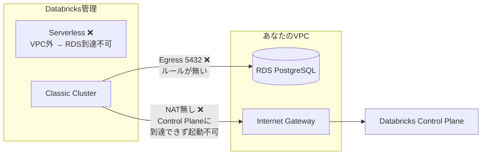

# RDS接続エラー — 全対応事項まとめ

## 問題の全体像

現在 **3つの問題** が重なっています:

| # | 問題 | 影響 | 状態 |
|---|------|------|------|
| 1 | Serverless クラスターを使用中 | VPC外なのでRDSに接続不可 | ⚠️ Classic に切替が必要 |
| 2 | NAT Gateway が無い | Classic クラスターが起動できない (BOOTSTRAP_TIMEOUT) | ❌ **最優先で対応** |
| 3 | SG に 5432 Egress が無い | クラスター起動後もRDSに通信不可 | ⚠️ NAT追加後に対応 |

> [!IMPORTANT]
> 問題 2 が根本原因です。Databricks の Secure Cluster Connectivity (SCC) はクラスターノードに**パブリックIPを付与しません**。そのため `MapPublicIpOnLaunch: true` でも IGW 経由のインターネットアクセスが機能せず、Control Planeに到達できません。**NAT Gateway が必須**です。

---

## 対応手順（AWS Console から実施）

### Step 1: NAT Gateway の作成（〜5分）

1. AWS Console → **VPC** → **NAT ゲートウェイ** → **NAT ゲートウェイを作成**
2. 以下を入力:
   - **名前**: `northwind-nat`
   - **サブネット**: `northwind-public-subnet`（**Public** サブネットを選択）
   - **接続タイプ**: パブリック
   - **Elastic IP**: 「Elastic IP を割り当て」をクリック
3. **NAT ゲートウェイを作成** → ステータスが `Available` になるまで待機（1〜2分）

### Step 2: Private ルートテーブルの更新（〜1分）

1. AWS Console → **VPC** → **ルートテーブル**
2. `northwind-private-rt` を選択
3. **ルート** タブ → **ルートを編集**
4. `0.0.0.0/0` の行を見つけ、ターゲットを **IGW → NAT Gateway** (`northwind-nat`) に変更
5. **変更を保存**

### Step 3: SG に PostgreSQL Egress を追加（〜1分）

1. AWS Console → **EC2** → **セキュリティグループ**
2. `northwind-dbx-compute-sg` を選択
3. **アウトバウンドルール** → **編集** → 追加:
   - タイプ: **PostgreSQL** / ポート: **5432** / 送信先: **0.0.0.0/0**
4. **保存**

---

## 対応後の確認

1. Databricks で **northwind-cluster** を起動 → 緑チェックマークが出ること
2. Notebook [01_load_northwind_to_rds.py](file:///c:/Users/haru/Documents/GitHub/databricks_datamng/AWS%E3%82%B7%E3%83%B3%E3%82%B0%E3%83%AB%E3%82%AF%E3%83%A9%E3%82%A6%E3%83%89Ver/%E9%96%8B%E7%99%BA%E3%83%89%E3%82%AD%E3%83%A5%E3%83%A1%E3%83%B3%E3%83%88/notebooks/01_load_northwind_to_rds.py) を Classic クラスターにアタッチして実行
3. `✅ northwind.sql 実行完了` が表示されること

---

## コスト影響

| リソース | コスト |
|---------|--------|
| NAT Gateway | 〜$0.062/時間 ≈ **〜$45/月** (ap-northeast-1) |
| NAT データ処理 | $0.062/GB |

> [!TIP]
> 学習時のみ NAT Gateway を起動し、使わない時は削除すればコストを抑えられます。ルートテーブルの `0.0.0.0/0` を IGW に戻せば元の状態に復帰できます。
