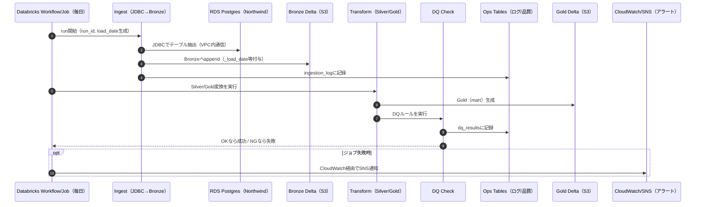

# システムフロー図（AWSシングルクラウド版）

ジョブの実行フローを示すシーケンス図です。

## ジョブ構成

| ジョブ名 | 実行順序 | 処理内容 | 依存 |
|---------|---------|---------|------|
| Ingest Job | 1 | RDS → Bronze (S3) | なし |
| Transform Job | 2 | Bronze → Silver → Gold | Ingest完了 |
| DQ Check | 3 | 品質チェック実行 | Transform完了 |
| Alert | (条件付き) | 失敗時SNS通知 | DQ NG時 |

---

## 変更履歴

| 日付 | 変更内容 |
|------|----------|
| 2026-03-08 | シングルクラウド版として再設計（CloudWatch/SNSアラート追加） |
