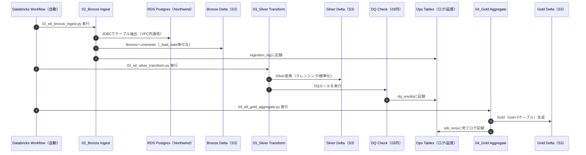

# システムフロー図（AWSシングルクラウド版）

ジョブの実行フローを示すシーケンス図です。

## ETLパイプライン構成

> Databricks Workflow（Job名: `northwind_daily_pipeline`）により毎日 21:00（JST）に自動実行。Job Cluster 使用。実行結果はメール通知済み（Story 1-3〜1-5 完了）。

| Notebook | 実行順序 | 処理内容 | 依存 |
|----------|---------|---------|------|
| `02_etl_bronze_ingest.py` | 1 | RDS → Bronze (S3) + ingestion_log記録 | なし |
| `03_etl_silver_transform.py` | 2 | Bronze → Silver + DQ Check + dq_results記録 | 02完了 |
| `04_etl_gold_aggregate.py` | 3 | Silver → Gold (4マート) + job_runs記録 | 03完了 |

---

## 変更履歴

| 日付 | 変更内容 |
| ------ | ---------- |
| 2026-03-08 | シングルクラウド版として再設計（CloudWatch/SNSアラート追加） |
| 2026-03-22 | Notebook実装と同期: シーケンス図のDQ順序修正（Silver内）、ジョブ構成を02→03→04の3タスクに修正、現状手動実行を明記 |
| 2026-03-30 | ETL構成注記・mermaid図を実態に合わせて更新: Workflow 自動化反映（実行者を手動→Databricks Workflow）、Bronze書き込みモードを append→overwrite に修正（Story 1-1〜1-5 完了） |
