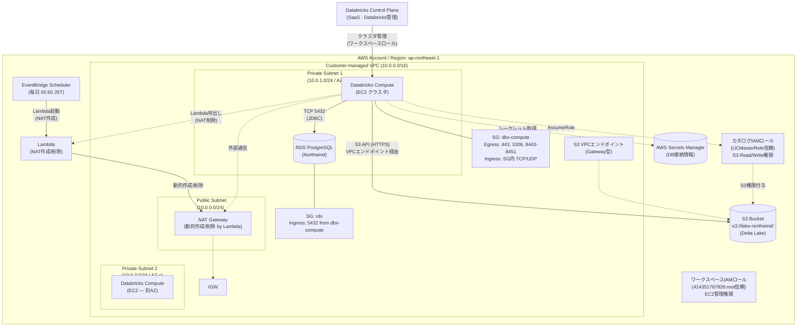

# システム構成図（AWSシングルクラウド版）

このダイアグラムは「**どこに何があるか**」を示す物理的な構成図です。
全リソースがAWS上に配置され、Customer-managed VPC内で完結します。

## 構成要素一覧

| カテゴリ | 要素 | 説明 | ステータス |
| --------- | ------ | ------ | ----------- |
| **ネットワーク** | Customer-managed VPC | Databricks ComputeとRDSを同一VPCに配置 | ✅ |
| | Private Subnet 1 | Compute + RDS配置 (AZ-a) | ✅ |
| | Private Subnet 2 | Compute配置 (AZ-c) — 異なるAZ要件 | ✅ |
| | Public Subnet | NAT Gateway経由で外部通信 | ✅ |
| | Security Group (Compute) | Egress: 443, 3306, 8443-8451 / Ingress: SG内TCP+UDP | ✅ |
| | Security Group (RDS) | Ingress: 5432 from Compute SG | ✅ |
| | IGW | VPCからインターネットへの出口 | ✅ |
| | NAT Gateway | Private Subnetからの外部通信（Lambda により動的作成/削除） | ✅ |
| | S3 VPCエンドポイント | Gateway型 (S3通信最適化) | ✅ |
| **コンピュート** | Databricks Compute | EC2ベースのSparkクラスタ | ✅ |
| | RDS PostgreSQL | ソースデータ（Northwind） | ✅ |
| **ストレージ** | S3 | データレイク（Delta Lake） + バケットポリシー | ✅ |
| **セキュリティ** | カタログIAMロール | S3アクセス権限（UCMasterRole信頼） | ✅ |
| | ワークスペースIAMロール | EC2管理権限（クロスアカウント） | ✅ |
| | Secrets Manager | DB接続情報の安全な管理 | ✅ |
| **監視/運用** | EventBridge Scheduler | Lambda をトリガー（毎日 05:50 JST） | ✅ |
| | Lambda | NAT Gateway の動的作成/削除 | ✅ |

---

## 変更履歴

| 日付 | 変更内容 |
| ------ | ---------- |
| 2026-03-08 | シングルクラウド版として再設計 |
| 2026-03-09 | IAMロール2種、SG詳細、VPCエンドポイント、Private Subnet 2追加 |
| 2026-03-30 | CloudWatch/SNS（未実装）を削除。NAT Gateway を動的管理に更新（Story 1-6: Lambda + EventBridge Scheduler）、構成要素一覧を実態に同期 |
