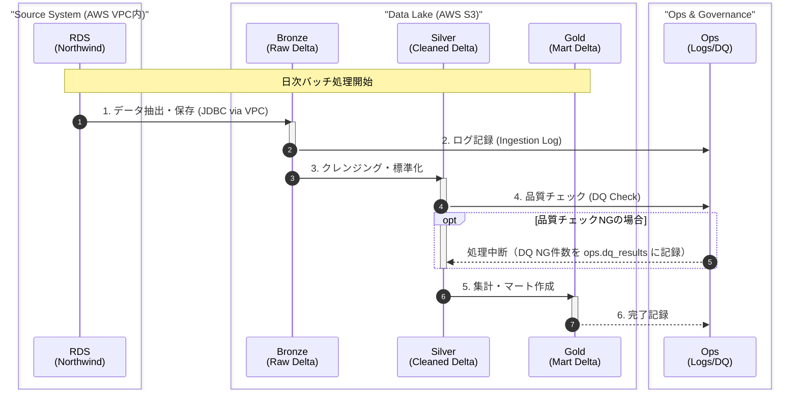

# データフロー図（AWSシングルクラウド版）

このダイアグラムはデータの流れと各処理ステップを示すUML風シーケンス図です。

## フロー概要

| ステップ | 処理内容 | 入力 | 出力 | 通信経路 |
| --------- | --------- | ------ | ------ | --------- |
| 1 | データ抽出 | RDS (Northwind) | Bronze (S3) | VPC内 JDBC |
| 2 | ログ記録 | 抽出メタデータ | Ops (S3) | S3 API |
| 3 | クレンジング | Bronze (S3) | Silver (S3) | S3 API |
| 4 | 品質チェック | Silver データ | Ops (S3) | S3 API |
| 5 | 集計 | Silver (S3) | Gold (S3) | S3 API |
| 6 | 完了記録 | 処理結果 | Ops (S3) | S3 API |

---

## 変更履歴

| 日付 | 変更内容 |
| ------ | ---------- |
| 2026-03-08 | シングルクラウド版として再設計（VPC内通信） |
| 2026-03-30 | DQ NG 時の SNS アラート通知（未実装）を削除、ops.dq_results 記録に修正 |
