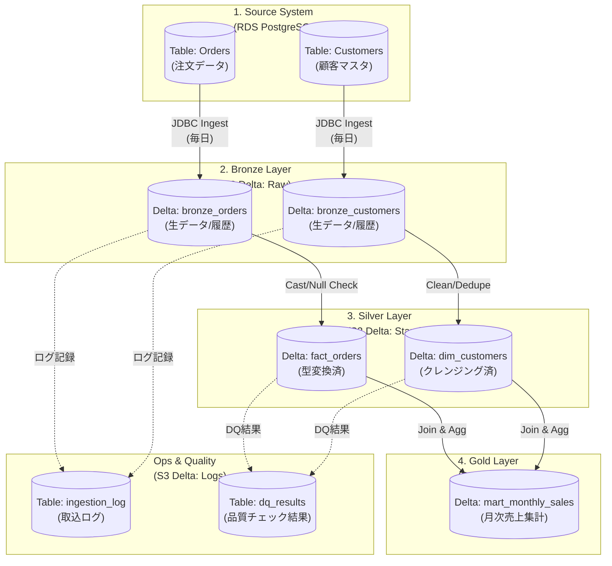

```mermaid
flowchart TB
  %% --- スイムレーン（縦の登場人物）定義 ---
  subgraph RDS ["1. Source System<br/>(RDS PostgreSQL)"]
    direction TB
    src_c[("Table: Customers<br/>(顧客マスタ)")]
    src_o[("Table: Orders<br/>(注文データ)")]
  end

  subgraph Bronze ["2. Bronze Layer<br/>(S3 Delta: Raw)"]
    direction TB
    brz_c[("Delta: bronze_customers<br/>(生データ/履歴)")]
    brz_o[("Delta: bronze_orders<br/>(生データ/履歴)")]
  end

  subgraph Ops ["Ops & Quality<br/>(S3 Delta: Logs)"]
    direction TB
    log_ingest[("Table: ingestion_log<br/>(取込ログ)")]
    log_dq[("Table: dq_results<br/>(品質チェック結果)")]
  end

  subgraph Silver ["3. Silver Layer<br/>(S3 Delta: Standard)"]
    direction TB
    sil_c[("Delta: dim_customers<br/>(クレンジング済)")]
    sil_o[("Delta: fact_orders<br/>(型変換済)")]
  end

  subgraph Gold ["4. Gold Layer<br/>(S3 Delta: Mart)"]
    direction TB
    mart[("Delta: mart_monthly_sales<br/>(月次売上集計)")]
  end

  %% --- データの流れ（処理） ---
  
  %% 1. Ingest (RDS -> Bronze)
  src_c -->|"JDBC Ingest<br/>(毎日)"| brz_c
  src_o -->|"JDBC Ingest<br/>(毎日)"| brz_o
  
  %% Log (Bronze作成時)
  brz_c -.->|"ログ記録"| log_ingest
  brz_o -.->|"ログ記録"| log_ingest

  %% 2. Transform (Bronze -> Silver)
  brz_c -->|"Clean/Dedupe"| sil_c
  brz_o -->|"Cast/Null Check"| sil_o

  %% DQ Check (Silver作成時)
  sil_c -.->|"DQ結果"| log_dq
  sil_o -.->|"DQ結果"| log_dq

  %% 3. Aggregate (Silver -> Gold)
  sil_c & sil_o -->|"Join & Agg"| mart
```
