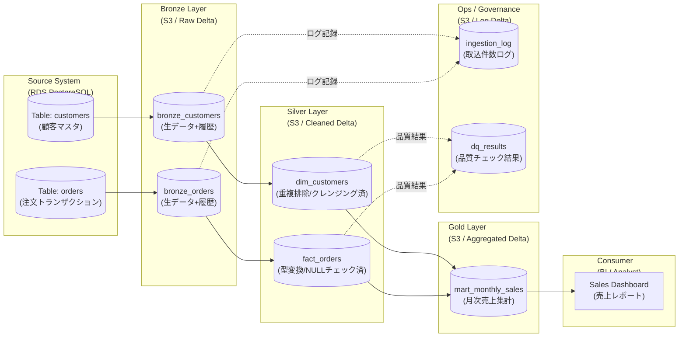

```mermaid
flowchart LR
  %% --- スイムレーン定義（左から右へ流れる） ---

  subgraph Source ["Source System<br/>(RDS PostgreSQL)"]
    direction TB
    d_cust[("Table: customers<br/>(顧客マスタ)")]
    d_ord[("Table: orders<br/>(注文トランザクション)")]
  end

  subgraph Bronze ["Bronze Layer<br/>(S3 / Raw Delta)"]
    direction TB
    b_cust[("bronze_customers<br/>(生データ+履歴)")]
    b_ord[("bronze_orders<br/>(生データ+履歴)")]
  end

  subgraph Silver ["Silver Layer<br/>(S3 / Cleaned Delta)"]
    direction TB
    s_cust[("dim_customers<br/>(重複排除/クレンジング済)")]
    s_ord[("fact_orders<br/>(型変換/NULLチェック済)")]
  end

  subgraph Gold ["Gold Layer<br/>(S3 / Aggregated Delta)"]
    direction TB
    g_mart[("mart_monthly_sales<br/>(月次売上集計)")]
  end

  subgraph Ops ["Ops / Governance<br/>(S3 / Log Delta)"]
    direction TB
    log_ingest[("ingestion_log<br/>(取込件数ログ)")]
    log_dq[("dq_results<br/>(品質チェック結果)")]
  end

  subgraph Consumer ["Consumer<br/>(BI / Analyst)"]
    dash["Sales Dashboard<br/>(売上レポート)"]
  end

  %% --- データの大まかな流れ ---
  
  %% RDS -> Bronze (Ingest)
  d_cust --> b_cust
  d_ord --> b_ord

  %% Bronze -> Ops (Log)
  b_cust -.->|"ログ記録"| log_ingest
  b_ord -.->|"ログ記録"| log_ingest

  %% Bronze -> Silver (Transform)
  b_cust --> s_cust
  b_ord --> s_ord

  %% Silver -> Ops (DQ Log)
  s_cust -.->|"品質結果"| log_dq
  s_ord -.->|"品質結果"| log_dq

  %% Silver -> Gold (Agg)
  s_cust --> g_mart
  s_ord --> g_mart

  %% Gold -> Consumer
  g_mart --> dash
```
