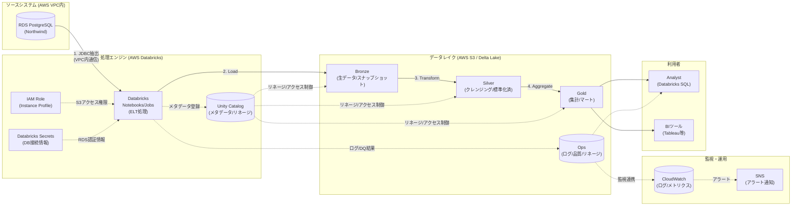

# 論理アーキテクチャ図（AWSシングルクラウド版）

このダイアグラムは「**何をどう処理するか**」を示す論理的な構成図です。
全リソースがAWS上に配置され、VPC内で完結する構成です。

## 構成要素一覧

| カテゴリ | 要素 | 説明 | ステータス |
|---------|------|------|-----------|
| **ソースシステム** | RDS PostgreSQL | Northwindデータベース（VPC内） | ✅ |
| **処理エンジン** | AWS Databricks | ELT処理（EC2ベース） | ✅ |
| | IAM Role | Instance Profile経由のS3アクセス権限 | ✅ |
| | Databricks Secrets | 認証情報の安全な管理 | ✅ |
| | Unity Catalog | メタデータ/リネージ/アクセス制御 | ✅ |
| **データレイク** | Bronze | 生データ/スナップショット（S3） | ✅ |
| | Silver | クレンジング/標準化済（S3） | ✅ |
| | Gold | 集計/マート（S3） | ✅ |
| | Ops | ログ/品質/リネージ（S3） | ✅ |
| **監視・運用** | CloudWatch | ログ・メトリクス・アラート | ✅ |
| | SNS | ジョブ失敗時の通知 | ✅ |
| **利用者** | Analyst | Databricks SQL | ✅ |
| | BIツール | Tableau等 | ✅ |

## 凡例

| 記号 | 意味 |
|------|------|
| `→` (実線) | データの流れ |
| `-.->` (点線) | メタデータ/制御の流れ |
| `[( )]` | データストア (DB/ファイル) |
| `[ ]` | 処理/サービス |

## AWSシングルクラウドの特徴

- **VPC内完結**: RDS→Databricks→S3 すべてAWS内で通信
- **IAM Role認証**: Instance Profile によるパスワードレスS3アクセス
- **低レイテンシ**: クロスクラウド通信なし
- **コスト最適**: データ転送料金ゼロ（VPC内）

---

## 変更履歴

| 日付 | 変更内容 |
|------|----------|
| 2026-03-08 | シングルクラウド版として再設計（Azure関連要素を全廃止） |
