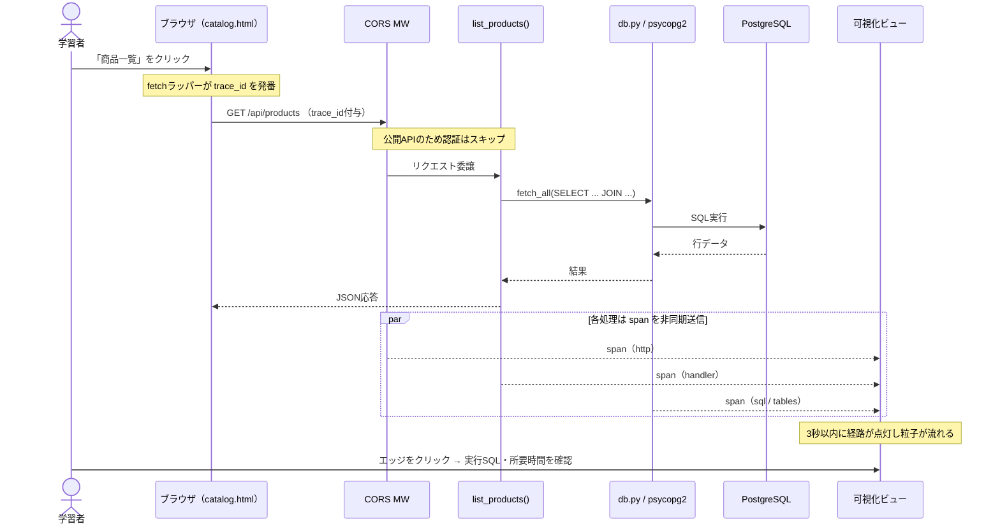
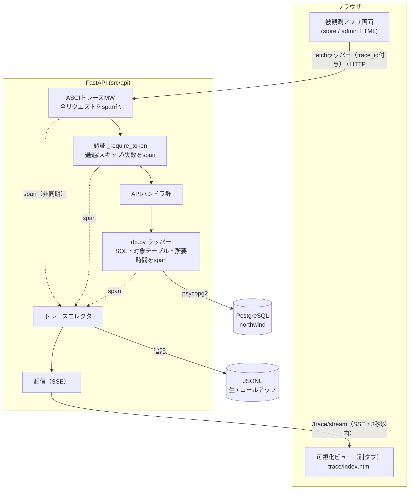
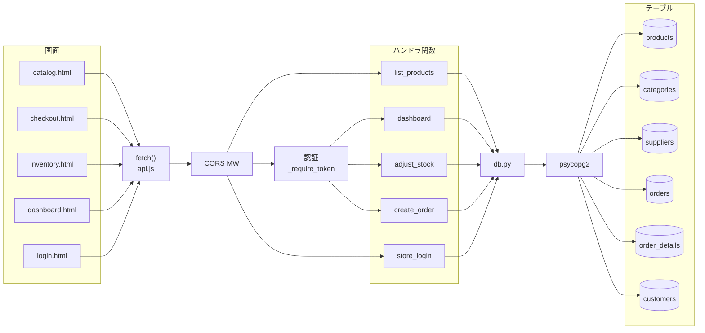

# 操作トレース可視化システム 要件定義書

> **ステータス：** ドラフト作成中（セクション単位で合意形成しながら追記）
> **作成日：** 2026-06-17
> **対象システム：** Northwind Web アプリ層（`src/api` FastAPI ＋ ローカル PostgreSQL）
> **本書の位置づけ：** 利用者の操作が内部で起こす通信・プログラム実行の連鎖を可視化する新規ツールの要件定義。

---

## 確定した主要意思決定（ヒアリング結果）

| # | 論点 | 決定 | 補足 |
|---|------|------|------|
| 1 | マップ粒度 | **開発者向け詳細** | 画面 → fetch → CORSミドルウェア → 認証 → ハンドラ関数 → db.py → psycopg2 → SQL → テーブル まで |
| 2 | 対象範囲 | **ローカル開発環境のみ** | 単一ユーザー前提、可視化システム自体の認証は不要 |
| 3 | 見せ方 | **2モード切替** | リアルタイム＝グラフ＋粒子アニメ／履歴＝Sankey＋ヒートマップ |
| 4 | 計測方式 | **軽量自前トレーサー** | ASGIミドルウェア＋db.py関数ラップ＋フロントfetchラッパー（クリック起点を相関ID化） |
| 5 | 保存先 | **JSONLファイルのみ** | 生イベントJSONL＋定期ロールアップJSONL（分/時/日）の二段構えで1年窓も軽量化 |
| 6 | 計測対象／束ね方 | **全通信を対象（クリック単位で束ねる）** | クリック起点の通信は1相関IDに集約。クリックを伴わない自動発火通信（画面表示時に走る通信等）も各々ルートとして捕捉する |

> **2026-06-18 レビュー反映：** 実装計画前のレビューで7項目の方針を確定。詳細は巻末「付録A：レビュー質疑応答・決定事項」を参照。役割分担として、**依頼者へはゴール・要望のみ確認し、技術的手段は実装者が提案ベースで決定**する方針を採用。

---

## 1. 背景・目的・スコープ

### 1.1 背景
Northwind Lakehouse の Web アプリ層（FastAPI ＋ ローカル PostgreSQL）は「ブラウザ → fetch → API → psycopg2 → DB」という多段構成を持つが、利用者には各操作が**内部でどの通信・どのプログラムを動かしているか**が見えない。この不可視性がシステム理解の障壁になっている。

### 1.2 目的
利用者が EC ストア／業務管理アプリを操作した際、**その1クリックが引き起こした通信とプログラム実行の連鎖を、リアルタイム（レイテンシ3秒以内）に視覚化**する。さらに**時間軸（10分／1時間／1日／1週／1月／1年）を切り替えて、どの経路がどれだけ通されたかを集計表示**する。これにより利用者は「ポチポチ押す → 可視化を見る」を繰り返してシステム構造を体感的に習得する。

### 1.3 スコープ
- **対象：** ローカル開発環境のみ。自分の PC 上の FastAPI（`src/api`）＋ ローカル PostgreSQL（northwind）。単一ユーザー前提、可視化システム自体の認証は不要。
- **対象外（今回作らない）：** AWS 本番（RDS/Databricks/S3）、Bronze/Silver/Gold ETL、複数ユーザー対応、アクセス制御。将来拡張余地として記載のみ。

### 1.4 成功基準
1. 任意の画面操作後、**3秒以内**に該当経路が可視化される。
2. **開発者向け詳細粒度**（ミドルウェア・認証・関数・SQL・テーブル）まで辿れる。
3. **6つの時間窓**すべてで経路と通過量が表示できる。

---

## 2. アクター・ユースケース

### 2.1 アクター
| アクター | 説明 |
|---|---|
| **学習者（主アクター）** | 本システムの唯一の利用者。EC ストア／業務管理アプリを操作し、その結果を可視化ビューで観察してシステム構造を学ぶ。操作者と観察者を兼ねる。 |
| 被観測アプリ（FastAPI＋PostgreSQL） | 計測対象。トレーサーに計測される側。能動的な操作はしない。 |

### 2.2 ユースケース一覧
| ID | ユースケース | 概要 |
|---|---|---|
| UC-1 | リアルタイムで経路を観察する | 学習者がアプリで操作すると、3秒以内に「画面→fetch→ミドルウェア→認証→ハンドラ→db→SQL→テーブル」の経路がグラフ上に粒子として流れる。 |
| UC-2 | 1操作の連鎖を辿る | 直前のクリック1回が引き起こしたイベント連鎖（相関IDで束ねた1トレース）を選択し、ステップ順に確認する。 |
| UC-3 | 時間窓を切り替えて通過量を見る | 10分/1時間/1日/1週/1月/1年を切替え、各経路（エッジ）が期間内に何回通ったかを Sankey の線の太さ／ヒートマップ濃度で把握する。 |
| UC-4 | ノード/経路の詳細を見る | グラフ上のノード（例：`GET /api/products`）やエッジを選ぶと、実体（関数名・SQL文・対象テーブル・平均所要時間・回数）を確認する。 |
| UC-5 | 可視化を見ながら操作して学ぶ | アプリ画面と可視化ビューを並べ、操作→反応の対応づけを反復してシステムを習得する（主目的の体験）。 |

### 2.3 代表シナリオ（UC-1 / UC-5）
1. 学習者は可視化ビュー（別タブ／別ウィンドウ）とストア画面を並べる。
2. ストアで「商品一覧」を開く → ブラウザが `GET /api/products` を発行。
3. トレーサーが「fetch開始 → CORS → 認証スキップ(公開API) → `list_products()` → `db.fetch_all()` → psycopg2 → `SELECT ... FROM products JOIN categories/suppliers` → 結果返却」を記録。
4. 3秒以内に可視化ビューで該当経路が点灯し、粒子が画面→API→DB→テーブルへ流れる。
5. 学習者はエッジをクリックし、実行SQLと所要時間を確認する（UC-4）。



---

## 3. 機能要件

### 3.1 計測（トレーサー）
| ID | 要件 |
|---|---|
| FR-T1 | フロントエンドの `fetch`（`src/web/js/api.js`）をラップし、各通信に**相関ID（trace_id）**と**span_id**を付与する。クリック等のユーザー操作があればそれをルートspanとして発番し、**クリックを伴わない自動発火通信（画面ロード時に走る通信等）も独立した1トレースとして捕捉する（全通信が対象）**。 |
| FR-T2 | FastAPI に **ASGIミドルウェア**を追加し、全リクエストの受信〜応答（メソッド・パス・ステータス・所要時間）を自動でspan化する。 |
| FR-T3 | 認証処理（`_require_token` / `Depends`）の通過・スキップ・失敗をspanとして記録する。 |
| FR-T4 | `db.py` の `fetch_all` / `fetch_one` / `execute` をラップし、**実行SQL・パラメータ件数・対象テーブル・所要時間**をspan化する。対象テーブルはSQLから正確に抽出することを方針とし、**抽出に失敗した場合は「不明」と表示**する（処理は継続）。 |
| FR-T5 | 各spanは親子関係（trace_id＋parent_span_id）を保持し、1クリックの連鎖を1トレースに再構成できる。 |
| FR-T6 | 計測は被観測アプリの**動作・レスポンスを変えない**（記録失敗時もアプリ処理は継続。観測の副作用ゼロ）。 |

### 3.2 収集・保存
| ID | 要件 |
|---|---|
| FR-S1 | spanを **生イベントJSONL**（`trace/events-YYYYMMDD.jsonl` 等）へ追記する。1行＝1span。 |
| FR-S2 | **ロールアップJSONL**（分/時/日単位の、エッジごと通過回数・平均所要時間の集計）を生成・追記する。実行タイミングは**アプリ起動時＋操作のたびの差分集計**（漸進更新）とし、**進行中の時間バケット（例：10:30時点の「10時台」）も「途中経過」として表示対象に含める**（学習ツールのためリアルタイム感を優先）。 |
| FR-S3 | 生イベントは短期保持（既定7日）。ロールアップは最長1年保持。古いファイルは自動削除（任意）。 |

### 3.3 配信（リアルタイム）
| ID | 要件 |
|---|---|
| FR-R1 | 可視化ビューへ新規spanを**3秒以内**に届ける（SSE等のサーバープッシュを想定）。 |
| FR-R2 | リアルタイムは「直近の操作」を対象に、経路の点灯と粒子アニメで表現する。 |
| FR-R3 | リアルタイム表示の対象は**可視化ビューを開いて以降に発生した通信**とする（開く前の操作はリアルタイムには出さない。過去分は履歴モードでJSONLから参照）。 |

### 3.4 可視化ビュー（UI）
| ID | 要件 |
|---|---|
| FR-U1 | **リアルタイムモード**：固定レイアウトのネットワークグラフ上を、発生したspanが粒子として 画面→fetch→ミドルウェア→認証→ハンドラ→db→SQL→テーブル の順に流れる。 |
| FR-U2 | **履歴モード**：時間窓トグル（10分/1時間/1日/1週/1月/1年）で、各エッジの通過量を Sankey の線の太さ＋ヒートマップ濃度で表示。 |
| FR-U3 | 2モードはトグルで切替える。 |
| FR-U4 | ノード／エッジ選択で詳細（実体の関数名・SQL文・対象テーブル・回数・平均/最大所要時間）を表示する（UC-4）。 |
| FR-U5 | 直近トレース一覧から1クリック分を選び、ステップ順に連鎖を辿れる（UC-2）。 |
| FR-U6 | 可視化ビューは被観測アプリと並べて見られるよう、別ページ（同一FastAPIが `/static` で配信）として提供する。 |
| FR-U7 | ノード／エッジ詳細は **IT初心者でも理解できる解説**を備える。①一言での役割、②比喩を交えたやさしい説明、③対応する実体（ファイル・関数・実SQL）、④出現した専門用語の注釈（語・読み・意味、本文中はホバーで意味表示）の4段構成とする。 |
| FR-U8 | **失敗した経路を成功経路と視覚的に区別する**。認証失敗（401）・DBエラー等（span status=error/skipped）を**赤系で点灯**させる。失敗の経路は学習価値が高いため要件化する。 |

> **UI見た目の確定版：** [操作トレース可視化システム_UIモックアップ.html](操作トレース可視化システム_UIモックアップ.html)（ダミーデータで動作。本要件のレイアウト・粒子フロー・ヒート表現・解説パネルの基準とする）

---

## 4. 非機能要件

| 区分 | ID | 要件 |
|---|---|---|
| 性能 | NFR-P1 | 操作からリアルタイム可視化までの遅延 **3秒以内**（目標1秒）。計測起点（操作時刻／処理完了時刻のいずれか）は厳密に問わない。 |
| 性能 | NFR-P2 | 履歴モードの時間窓切替は **1秒以内**に再描画。1年窓でもロールアップJSONL参照で軽量に保つ。 |
| 性能 | NFR-P3 | 計測による被観測アプリの応答遅延増は **+30ms 以内/リクエスト**を目標（非同期書き出しで吸収）。 |
| 信頼性 | NFR-R1 | トレーサーの記録失敗・JSONL書込失敗が**被観測アプリの正常動作を妨げない**（FR-T6と一体。例外は握りつぶしてログのみ）。 |
| 信頼性 | NFR-R2 | 可視化ビューが落ちても被観測アプリは独立して動作する（疎結合）。 |
| 拡張性 | NFR-E1 | ノード/エッジ定義（経路マップ）は**事前定義（依頼者提供）を基本**とし、APIやテーブル追加時も定義の最小修正で追従できる構造とする。 |
| 拡張性 | NFR-E2 | 保存形式（JSONL）は将来 SQLite/DB へ差し替え可能なよう、書き込み口を1箇所に集約する。 |
| 運用 | NFR-O1 | 起動・停止は既存の `.bat`／`uvicorn` の延長で完結（新規ミドルウェア群を含む）。専用インフラ不要。 |
| 運用 | NFR-O2 | 生イベント7日・ロールアップ1年で**ディスク使用は上限管理**（古いファイル自動削除）。 |
| 移植性 | NFR-T1 | 可視化ビューは外部CDN非依存の単一HTML/JSで動作（オフライン・`file://`でも閲覧可）。 |
| セキュリティ | NFR-S1 | ローカル単一ユーザー前提のため可視化システム自体は無認証。ただし**トレースに認証トークン・パスワード等の秘匿値を保存しない**（マスキング/除外）。 |
| 教育性 | NFR-U1 | 解説はIT初心者基準（FR-U7）。専門用語は必ず注釈を伴う。 |

---

## 5. システム構成・データ設計

### 5.1 全体構成


### 5.2 主要コンポーネント
| コンポーネント | 役割 | 追加/変更 |
|---|---|---|
| fetchラッパー | クリックを起点に trace_id 発番、各通信に付与 | `src/web/js/api.js` 改修 |
| ASGIトレースMW | 全リクエストを自動span化 | 新規（`src/api` に追加） |
| 認証/ db.py 計装 | 認証結果・SQL・対象テーブル・所要時間を span 化 | `_require_token`・`db.py` をラップ |
| トレースコレクタ | span を受け取り JSONL 追記＋配信キューへ | 新規 |
| ロールアップ処理 | 分/時/日の集計JSONLを生成、保持期間管理 | 新規（定期実行 or 起動時/書込時バッチ） |
| 配信(SSE) | 新規 span を可視化ビューへ push | 新規エンドポイント `/trace/stream` |
| 可視化ビュー | リアルタイム／履歴の描画・解説 | 新規 `src/web/trace/`（モックアップが原型） |

### 5.3 データ設計（JSONL）
**生イベント span（1行1JSON）例：**
```json
{"trace_id":"a1b2c3","span_id":"s05","parent_span_id":"s04","ts":"2026-06-17T10:00:00.123",
 "layer":"db","node":"h_list","kind":"sql","detail":"SELECT ... FROM products ...",
 "tables":["products","categories","suppliers"],"dur_ms":12.4,"status":"ok"}
```
| フィールド | 意味 |
|---|---|
| trace_id | 1クリック＝1トレースを束ねる相関ID |
| span_id / parent_span_id | 親子関係（連鎖の再構成用） |
| ts / dur_ms | 発生時刻 / 所要時間 |
| layer / node | どのレイヤーのどのノードか（マップ対応） |
| kind / detail / tables | 種別（http/auth/sql等）・実体・対象テーブル |
| status | ok / error / skipped（認証スキップ等） |

**ロールアップ JSONL（エッジ集計）例：**
```json
{"window":"1h","bucket":"2026-06-17T10:00","edge":"h_list>db","count":312,"avg_ms":11.8}
```
保持：生イベント=既定7日、ロールアップ=分(1日)/時(30日)/日(1年)。

### 5.4 経路マップ（静的地図・8レイヤー）
可視化の土台となる「ノードとエッジの地図」。実際のNorthwindコード構造に対応する。事前定義（NFR-E1）し、リアルタイムでは該当経路が点灯、履歴では各エッジに通過量を重ねる。



> 注：`list_products`（公開API）と `store_login`（トークン発行側）は認証ノードを通らない。図はコードの事実を反映する。

---

## 6. 制約・前提・将来拡張

### 6.1 前提
- ローカル開発環境（自分のPC）で FastAPI ＋ ローカル PostgreSQL が稼働していること（`load_northwind.bat` 済み）。
- 利用者は1名（操作者＝観察者）。可視化ビューと被観測アプリ画面を並べて使う。

### 6.2 制約
| ID | 制約 |
|---|---|
| C-1 | 保存は **JSONLファイルのみ**（SQLite/DB不使用）。1年窓の性能はロールアップJSONLで担保する。 |
| C-2 | ビルドシステム・テストランナー無し（リポジトリ方針）。既存の `uvicorn`／`.bat` 起動の延長で動くこと。 |
| C-3 | 計装は **開発者向け詳細粒度**（画面→fetch→CORS→認証→ハンドラ→db→psycopg2→テーブル）。これ以上深い行レベルは対象外。 |
| C-4 | トレースに秘匿値（トークン・パスワード）を保存しない（NFR-S1）。 |

### 6.3 将来拡張（今回はスコープ外・記載のみ）
- AWS本番（RDS/Databricks/S3）や Bronze/Silver/Gold ETL への計装拡張。
- 保存先を SQLite/時系列DB へ差し替え（NFR-E2 の集約口を利用）。
- 複数ユーザー・アクセス制御、OpenTelemetry 準拠への移行。

---

## 7. 用語集

| 用語 | 読み | 意味 |
|---|---|---|
| トレース / span | ― | 1操作の処理連鎖（トレース）と、その中の1ステップ（span）。 |
| trace_id | トレースアイディー | 1クリックを束ねる相関ID。fetchラッパーが発番。 |
| ASGIミドルウェア | ― | リクエストが本処理に届く前後で共通処理を挟む“関所”。 |
| ロールアップ | ― | 生イベントを分/時/日単位で事前集計したもの。長期窓を軽量化。 |
| SSE | エスエスイー | サーバーからブラウザへ一方向で随時データを送る仕組み。リアルタイム配信に使用。 |
| エッジ / ノード | ― | マップ上の経路（線）と構成要素（点）。 |

---

## 付録A：レビュー質疑応答・決定事項（2026-06-18）

実装計画に進む前のレビューで、不明点7項目について方針を確定した。区分は **🙋依頼者判断**（やりたいこと・好み）／**🔧実装者判断**（技術的実現方法）。

| # | 論点 | 決定 | 区分 | 反映先 |
|---|------|------|------|--------|
| 1 | trace_id の追跡範囲（クリックを伴わない自動通信の扱い） | 自動発火通信も含め**全通信**を可視化対象。目印番号の運び方は実装者が設計 | 🙋＋🔧 | 決定#6, FR-T1 |
| 2 | 経路マップの用意方法（自動生成 or 事前定義） | **事前定義（依頼者が用意済み）**。本件は対応不要 | 🙋 | NFR-E1, 5.4 |
| 3 | 対象テーブル抽出の精度と失敗時挙動 | **正確に抽出**する方針。失敗時は**「不明」と表示** | 🙋＋🔧 | FR-T4 |
| 4 | ロールアップの実行タイミング／進行中バケットの扱い | **起動時＋操作のたび**に漸進集計。進行中の時間帯も**「途中経過」として表示** | 🔧（一任） | FR-S2 |
| 5 | 可視化ビューを開く前の操作の扱い | **開く前はリアルタイム表示不要**（履歴で参照可） | 🙋 | FR-R3 |
| 6 | 「3秒以内」の計測起点 | **厳密な定義は不問** | 🙋 | NFR-P1 |
| 7 | 失敗（エラー）経路の見せ方 | **赤系で点灯**し区別。学習価値が高く要件化 | 🔧（一任） | FR-U8 |

### 役割分担の方針（レビュー時の指摘を採用）
> 技術非専門の業務担当者へ要件定義を行う場合、技術的な実現手段（目印番号の運び方、SQL解析手法、集計タイミング等）を相手に判断させるべきではない。それらは作り手が責任を持って決め、提案・確認する形を取る。

今後の要件確認でも、**依頼者へはゴール・要望のみ確認し、技術的手段は実装者が提案ベースで決定する**役割分担を採用する。

---

> **本書の状態：** 全7章＋付録A 完成。UIの見た目・解説トーンはモックアップで合意済み。レビュー7項目も方針確定し反映済み。**実装計画（詳細設計）へ進む準備が整った状態。**

