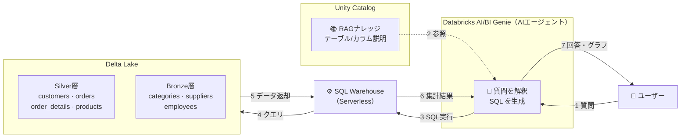

# ビジネスメタデータを用いた RAG テスト結果

## テストの目的

Unity Catalog に整備したビジネスメタデータ（テーブル/カラム説明・同義語・JOIN定義・SQL式）を  
Databricks AI/BI Genie のナレッジストアに読み込ませ、  
**自然言語の質問に対して正確な SQL が生成・回答できるか**を検証する。

---

## テスト項目（概要）

| # | テスト質問 | 検証ポイント |
|---|-----------|------------|
| 1 | 売上が一番多い国はどこですか? | 売上金額 Measure・国別集計 |
| 2 | カテゴリ別の売上を教えて | JOIN (products → categories)・グラフ出力 |
| 3 | 売上 TOP5 の顧客は? | 売上金額 Measure・顧客名 JOIN |
| 4 | 在庫切れの商品はありますか? | Filter（在庫切れ）条件の適用 |
| 5 | ドイツの顧客一覧を見せて | Entity Matching（国名の表記対応） |
| 6 | 月別の注文件数の推移を見せて | Dimension（注文年月）・時系列グラフ |
| 7 | 飲料カテゴリで一番売れている商品は? | 同義語（飲料→Beverages）・JOIN精度 |

---

## テスト環境 / システム構成

---

> **対象 Story**: 3-6 ／ **Sprint**: 2 ／ **実施日**: 2026-04
