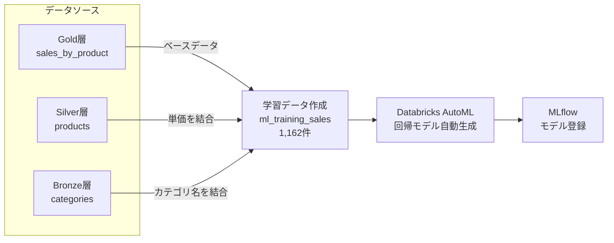

# 機械学習モデル構築（AutoML）サマリー

## 目的

Databricks AutoML で **商品別の月次売上金額を予測するモデル** を生成する。

---

## 実施概要

| 項目 | 内容 |
|------|------|
| 予測対象 | 月次売上金額（`total_sales` / 商品×月粒度） |
| 学習データ | `gold.ml_training_sales`（1,162件） |
| アルゴリズム | Databricks AutoML 自動選択|

### データの流れ

Gold 層の売上集計テーブル（`sales_by_product`）をベースに、Silver 層・Bronze 層から商品属性を結合し、学習データを作成した。

### 学習データの特徴量

EDA（探索的データ分析）により予測に有効な項目を選定し、以下の特徴量で学習データを構成した。

| 特徴量 | 意味 | 取得元 |
|--------|------|--------|
| `order_date` | 注文年月（月初日付） | `order_year` + `order_month` から生成 |
| `order_year` | 注文年 | Gold: `sales_by_product` |
| `order_month` | 注文月 | Gold: `sales_by_product` |
| `product_name` | 商品名 | Gold: `sales_by_product` |
| `category_name` | 商品カテゴリ名 | Bronze: `categories` より結合 |
| `unit_price` | 商品単価 | Silver: `products` より結合 |
| `total_quantity` | 月次注文数量 | Gold: `sales_by_product` |
| `order_count` | 月次注文件数 | Gold: `sales_by_product` |
| **`total_sales`** | **月次売上金額（予測対象）** | Gold: `sales_by_product` |

---

## 実施結果

### ベストモデル評価指標（LightGBM Regressor）

| 指標 | 学習（Train） | 検証（Validation） | テスト（Test） |
|------|:---:|:---:|:---:|
| R² スコア | 0.963 | **0.881** | 0.708 |
| RMSE | 259 | 613 | 1,527 |
| MAE | 83 | 240 | 419 |

### 考察

検証 R² = 0.881 は一見高水準だが、以下の問題が判明した。

**データリーケージ（情報漏洩）**: `total_quantity`（注文数量）と `order_count`（注文件数）は `total_sales`（売上金額 = 単価 x 数量）の構成要素であり、実際の予測時点では入手できない未来の情報にあたる。これらが学習データに含まれていたため、モデルが「答えの一部を見てカンニングしている」状態となり、精度が不当に高くなっている。

**過学習**: データ件数が約1,100件と少なく、Train RMSE 259 に対し Test RMSE 1,527 と大きく乖離している。

### 次のアクション（Story 4-3 へ）

`total_quantity`・`order_count` を除外して再学習し、リークのない状態での真の予測精度を測定する。

---

> **対象 Story**: 4-1, 4-2 ／ **Sprint**: 3 ／ **実施日**: 2026-04
