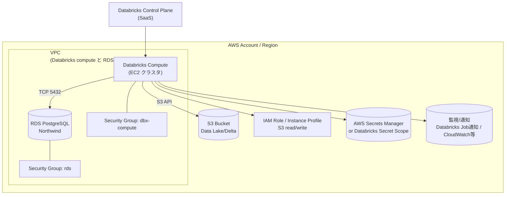

```mermaid
flowchart TB
  subgraph AWS["AWS Account / Region"]
    subgraph VPC["VPC<br/>(Databricks compute と RDS を同居が簡単)"]
      DBXCompute["Databricks Compute<br/>(EC2 クラスタ)"]
      RDS[("RDS PostgreSQL<br/>Northwind")]
      SGdbx["Security Group: dbx-compute"]
      SGrds["Security Group: rds"]
      DBXCompute --- SGdbx
      RDS --- SGrds
      DBXCompute -->|"TCP 5432"| RDS
    end

    S3[("S3 Bucket<br/>Data Lake/Delta")]
    IAMRole["IAM Role / Instance Profile<br/>S3 read/write"]
    Secrets[("AWS Secrets Manager<br/>or Databricks Secret Scope")]
    Monitor[("監視/通知<br/>Databricks Job通知 / CloudWatch等")]
  end

  ControlPlane["Databricks Control Plane<br/>(SaaS)"] --> DBXCompute
  DBXCompute -->|"S3 API"| S3
  DBXCompute --> IAMRole
  DBXCompute --> Secrets
  DBXCompute --> Monitor
```
