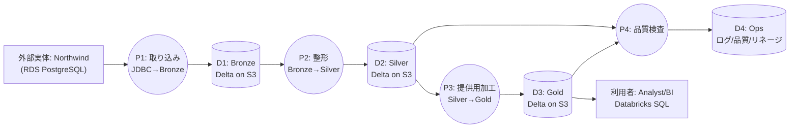

```mermaid
flowchart LR
  E1["外部実体: Northwind<br/>(RDS PostgreSQL)"]
  P1(("P1: 取り込み<br/>JDBC→Bronze"))
  D1[("D1: Bronze<br/>Delta on S3")]
  P2(("P2: 整形<br/>Bronze→Silver"))
  D2[("D2: Silver<br/>Delta on S3")]
  P3(("P3: 提供用加工<br/>Silver→Gold"))
  D3[("D3: Gold<br/>Delta on S3")]
  P4(("P4: 品質検査"))
  D4[("D4: Ops<br/>ログ/品質/リネージ")]
  E2["利用者: Analyst/BI<br/>Databricks SQL"]

  E1 --> P1 --> D1 --> P2 --> D2 --> P3 --> D3 --> E2
  D2 --> P4 --> D4
  D3 --> P4
```
