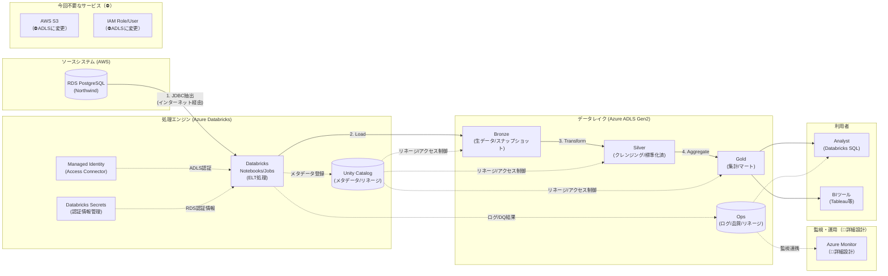

# 論理アーキテクチャ図（移行前：Azure Databricks + Azure ADLS）

このダイアグラムは「**何をどう処理するか**」を示す論理的な構成図です。
移行前（暫定構成）では、Azure Databricksで処理し、Azure ADLS Gen2にデータを保存します。

## ステータス凡例

- 通常表記: 記載済み
- `（📝暗黙）`: 存在が前提だが詳細は省略
- `（🔧詳細設計）`: 詳細設計フェーズで追加予定
- `（⛔不要）`: 今回のプロジェクトでは使用しない

## 構成要素一覧

| カテゴリ | 要素 | 説明 | ステータス |
|---------|------|------|------------|
| **ソースシステム** | RDS PostgreSQL | Northwindデータベース（AWS） | ✅ |
| **処理エンジン** | Azure Databricks | ELT処理 | ✅ |
| | Managed Identity | Access Connector経由のADLS認証 | ✅ |
| | Databricks Secrets | 認証情報の安全な管理 | ✅ |
| | Unity Catalog | メタデータ/リネージ/アクセス制御 | ✅ |
| **データレイク** | Bronze | 生データ/スナップショット（ADLS） | ✅ |
| | Silver | クレンジング/標準化済（ADLS） | ✅ |
| | Gold | 集計/マート（ADLS） | ✅ |
| | Ops | ログ/品質/リネージ（ADLS） | ✅ |
| **監視・運用** | Azure Monitor | ログ・メトリクス・アラート | 🔧詳細設計 |
| **利用者** | Analyst | Databricks SQL | ✅ |
| | BIツール | Tableau等 | ✅ |
| **今回不要** | AWS S3 | ADLSに変更 | ⛔不要 |
| | IAM Role/User | ADLSに変更 | ⛔不要 |

## 凡例

| 記号 | 意味 |
|------|------|
| `→` (実線) | データの流れ |
| `-.->` (点線) | メタデータ/制御の流れ |
| `[( )]` | データストア (DB/ファイル) |
| `[ ]` | 処理/サービス |

## 移行前の特徴

- **Azure内データレイク**: Bronze/Silver/GoldはすべてAzure ADLS Gen2に保存
- **JDBC接続**: インターネット経由でRDSに接続（SSL必須）
- **ADLS接続**: Managed Identity（パスワードレス）
- **Unity Catalog**: ✅ 使用可能（メタデータ管理、リネージ、アクセス制御）

## 変更履歴

| 日付 | 変更内容 |
|------|----------|
| 2024-02-08 | データレイクをAWS S3からAzure ADLS Gen2に変更 |
