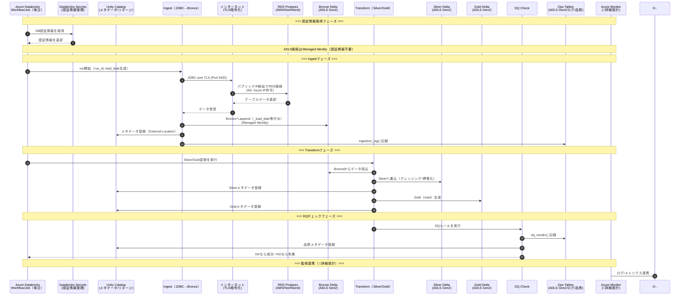

# システムフロー図（移行前：Azure Databricks + Azure ADLS）

```mermaid
sequenceDiagram
  autonumber
  participant W as Azure Databricks<br/>Workflow/Job（毎日）
  participant SEC as Databricks Secrets<br/>(認証情報管理)
  participant UC as Unity Catalog<br/>(メタデータ/リネージ)
  participant I as Ingest（JDBC→Bronze）
  participant INET as インターネット<br/>(TLS暗号化)
  participant P as RDS Postgres<br/>(AWS/Northwind)
  participant B as Bronze Delta<br/>(ADLS Gen2)
  participant T as Transform（Silver/Gold）
  participant S as Silver Delta<br/>(ADLS Gen2)
  participant G as Gold Delta<br/>(ADLS Gen2)
  participant D as DQ Check
  participant O as Ops Tables<br/>(ADLS Gen2/ログ/品質)
  participant AZM as Azure Monitor<br/>(🔧詳細設計)

  Note over W,AZM: === 認証情報取得フェーズ ===
  W->>SEC: DB認証情報を取得
  SEC-->>W: 認証情報を返却
  Note over W,AZM: ADLS接続はManaged Identity（認証情報不要）

  Note over W,AZM: === Ingestフェーズ ===
  W->>I: run開始（run_id, load_date生成）
  I->>INET: JDBC over TLS (Port 5432)
  INET->>P: パブリックIP経由でRDS接続<br/>(SG: Azure IP許可)
  P-->>INET: テーブルデータ返却
  INET-->>I: データ受信
  
  I->>B: Bronzeへappend（_load_date等付与）<br/>(Managed Identity)
  I->>UC: メタデータ登録（External Location）
  I->>O: ingestion_logに記録

  Note over W,AZM: === Transformフェーズ ===
  W->>T: Silver/Gold変換を実行
  T->>B: Bronzeからデータ読込
  T->>S: Silverへ書込（クレンジング/標準化）
  T->>UC: Silverメタデータ登録
  T->>G: Gold（mart）生成
  T->>UC: Goldメタデータ登録

  Note over W,AZM: === DQチェックフェーズ ===
  T->>D: DQルールを実行
  D->>O: dq_resultsに記録
  D->>UC: 品質メタデータ登録
  D-->>W: OKなら成功 / NGなら失敗

  Note over W,AZM: === 監視連携（🔧詳細設計）===
  O-.->AZM: ログ/メトリクス連携
```

## 変更履歴

| 日付 | 変更内容 |
|------|----------|
| 2024-02-08 | データレイクをAWS S3からAzure ADLS Gen2に変更 |
