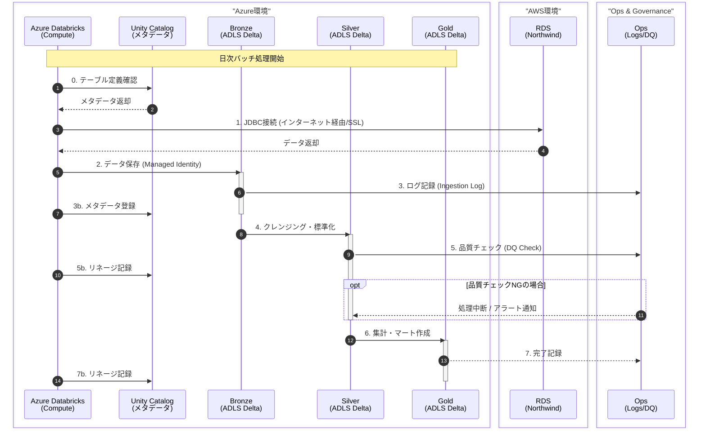

# データフロー（移行前：Azure Databricks + Azure ADLS）

移行前（暫定構成）のデータフローを示すシーケンス図です。
Azure DatabricksからAWS RDSに接続し、Azure ADLS Gen2にデータを保存します。

## 移行前の注意点

1. **Azure内データレイク**: Bronze/Silver/GoldはすべてAzure ADLS Gen2に保存
2. **RDSへのアクセスはインターネット経由**: RDSのパブリックエンドポイントを使用
3. **SSL必須**: `sslmode=require` を接続文字列に含める
4. **ADLS接続はManaged Identity**: パスワードレス認証
5. **Unity Catalog**: メタデータ管理とリネージ追跡に使用

## Unity Catalog の役割

| 機能 | 説明 |
|------|------|
| **メタデータ管理** | テーブル/カラムの定義、説明 |
| **リネージ** | データの出自・変換履歴 |
| **アクセス制御** | ユーザー/グループ単位の権限管理 |
| **データ発見** | カタログ検索によるテーブル発見 |

## 変更履歴

| 日付 | 変更内容 |
|------|----------|
| 2024-02-08 | データレイクをAWS S3からAzure ADLS Gen2に変更 |
