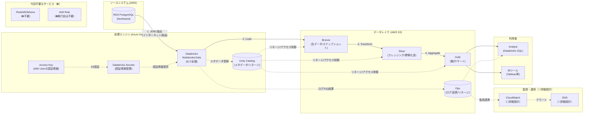

# 論理アーキテクチャ図（移行前：Azure Databricks → AWS）

このダイアグラムは「**何をどう処理するか**」を示す論理的な構成図です。
移行前（暫定構成）では、Azure DatabricksからAWSのデータソースに接続します。

## ステータス凡例

- 通常表記: 記載済み
- `（📝暗黙）`: 存在が前提だが詳細は省略
- `（🔧詳細設計）`: 詳細設計フェーズで追加予定
- `（⛔不要）`: 今回のプロジェクトでは使用しない

## 構成要素一覧

| カテゴリ | 要素 | 説明 | ステータス |
|---------|------|------|------------|
| **ソースシステム** | RDS PostgreSQL | Northwindデータベース（AWS） | ✅ |
| **処理エンジン** | Azure Databricks | ELT処理 | ✅ |
| | Access Key | IAM Userの認証情報 | ✅ |
| | Databricks Secrets | 認証情報の安全な管理 | ✅ |
| | Unity Catalog | メタデータ/リネージ/アクセス制御 | ✅ |
| | IAM Role | Instance Profile経由のアクセス | ⛔移行前不要 |
| **データレイク** | Bronze | 生データ/スナップショット（AWS S3） | ✅ |
| | Silver | クレンジング/標準化済（AWS S3） | ✅ |
| | Gold | 集計/マート（AWS S3） | ✅ |
| | Ops | ログ/品質/リネージ（AWS S3） | ✅ |
| **監視・運用** | CloudWatch | ログ・メトリクス・アラート | 🔧詳細設計 |
| | SNS | 通知（メール/Slack等） | 🔧詳細設計 |
| **利用者** | Analyst | Databricks SQL | ✅ |
| | BIツール | Tableau等 | ✅ |
| **今回不要** | Redshift/Athena | Databricksを使用するため | ⛔不要 |

## 凡例

| 記号 | 意味 |
|------|------|
| `→` (実線) | データの流れ |
| `-.->` (点線) | メタデータ/制御の流れ |
| `[( )]` | データストア (DB/ファイル) |
| `[ ]` | 処理/サービス |

## 移行前の特徴

- **クロスクラウド構成**: Azure Databricks から AWS RDS/S3 に接続
- **JDBC接続**: インターネット経由でRDSに接続（SSL必須）
- **S3接続**: IAM User の Access Key を使用
- **Unity Catalog**: ✅ 使用可能（メタデータ管理、リネージ、アクセス制御）
- **監視**: CloudWatch/SNSは詳細設計フェーズで追加予定
