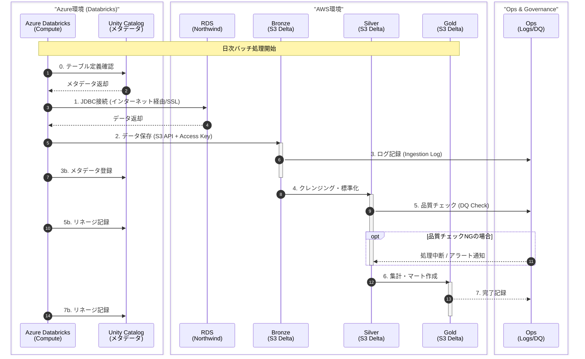

# データフロー（移行前：Azure Databricks → AWS）

移行前（暫定構成）のデータフローを示すシーケンス図です。
Azure DatabricksからAWS RDS/S3に接続するクロスクラウド構成です。

## 移行前の注意点

1. **クロスクラウド構成**: Azure Databricks から AWS RDS/S3 に接続
2. **JDBC接続はインターネット経由**: RDSのパブリックエンドポイントを使用
3. **SSL必須**: `sslmode=require` を接続文字列に含める
4. **S3接続はAccess Key**: IAM User の Access Key を Databricks Secrets に保存
5. **Unity Catalog**: メタデータ管理とリネージ追跡に使用

## Unity Catalog の役割

| 機能 | 説明 |
|------|------|
| **メタデータ管理** | テーブル/カラムの定義、説明 |
| **リネージ** | データの出自・変換履歴 |
| **アクセス制御** | ユーザー/グループ単位の権限管理 |
| **データ発見** | カタログ検索によるテーブル発見 |
