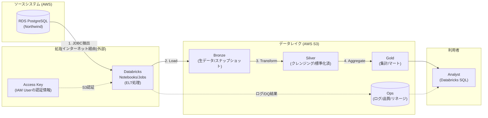

# 論理アーキテクチャ図（移行前：外部Databricks接続）

このダイアグラムは「**何をどう処理するか**」を示す論理的な構成図です。
移行前（暫定構成）では、DatabricksがAWS外部にあるため、一部の接続方法が異なります。

## 凡例

| 記号 | 意味 |
|------|------|
| `→` (実線) | データの流れ |
| `-.->` (点線) | メタデータ/制御の流れ |
| `[( )]` | データストア (DB/ファイル) |
| `[ ]` | 処理/サービス |

## 移行前の特徴

- **JDBC接続**: インターネット経由でRDSに接続（SSL必須）
- **S3接続**: IAM User の Access Key を使用（Instance Profile は使えない）
- **セキュリティ**: RDSをパブリックに公開する必要があり、IP制限が重要
