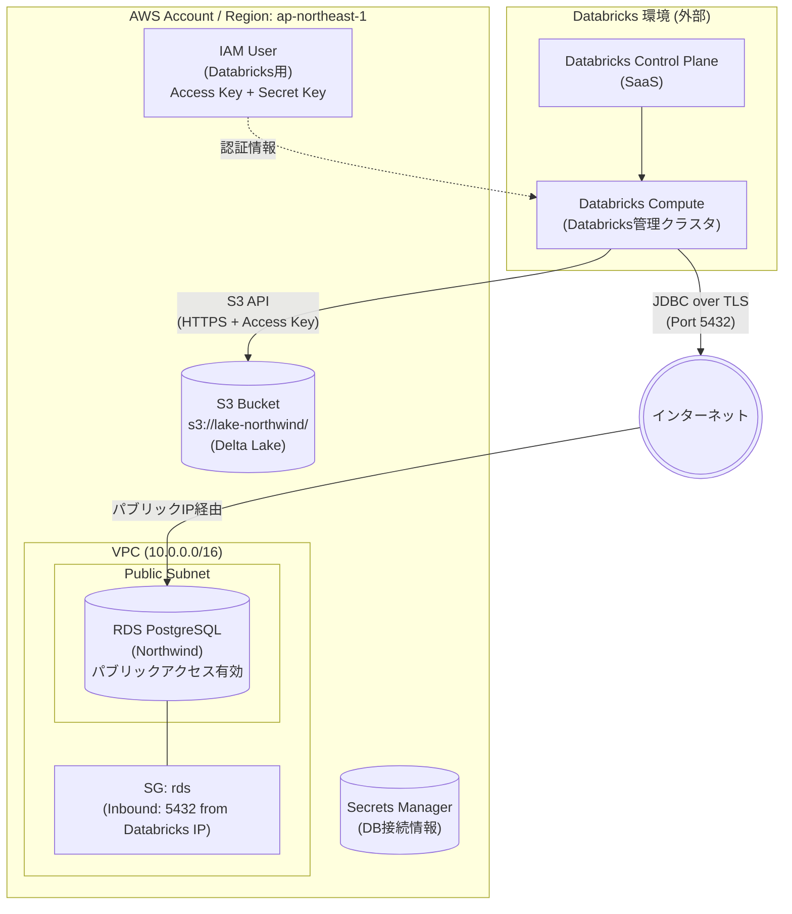

# システム構成図（移行前：外部Databricks接続）

このダイアグラムは「**暫定構成: DatabricksがAWS外部にある場合**」を示します。

## 前提条件

- **Databricks**: Databricks Community Edition または Databricks管理のクラウド環境（AWSアカウントとは無関係）
- **RDS**: ユーザー管理のAWSアカウント内に存在
- **接続**: インターネット経由（パブリックエンドポイント）

## 接続方法の詳細

### 1. RDS への接続

| 項目 | 設定 |
|------|------|
| **RDS パブリックアクセス** | 有効 (Publicly Accessible = Yes) |
| **Security Group** | Inbound: TCP 5432 を Databricks の IP 範囲から許可 |
| **SSL/TLS** | 必須 (`sslmode=require`) |
| **接続文字列例** | `jdbc:postgresql://<RDS-endpoint>:5432/northwind?sslmode=require` |

> [!WARNING]
> パブリックアクセスはセキュリティリスクがあります。IP制限 + SSL を必ず設定してください。
> 本番環境では PrivateLink または VPC Peering を使用してください。

### 2. S3 への接続

| 項目 | 設定 |
|------|------|
| **認証方式** | IAM User の Access Key + Secret Key |
| **権限** | S3 バケットへの Read/Write 権限 |
| **Databricks設定** | Secrets に Access Key を保存し、ノートブックから参照 |

### 3. Databricks IP 範囲の確認方法

Databricks Community Edition の場合、固定IPがないため、以下の対策が必要です：

1. **方法A**: RDS の Security Group で `0.0.0.0/0` からの 5432 を許可（非推奨）
2. **方法B**: Databricks クラスタ起動時に `%sh curl ifconfig.me` でIPを確認し、都度 SG を更新
3. **方法C**: RDS の代わりに S3 に CSV/Parquet を置き、それをソースとする（RDS不要）

## 移行後との差分

| 項目 | 移行前（暫定） | 移行後（最終） |
|------|----------------|----------------|
| Databricks環境 | 外部（Databricks管理） | AWS上（同一VPC） |
| RDSアクセス | パブリックIP + SG制限 | Private Subnet + VPC内通信 |
| S3認証 | IAM User (Access Key) | IAM Role (Instance Profile) |
| セキュリティ | 中（インターネット経由） | 高（VPC内完結） |
