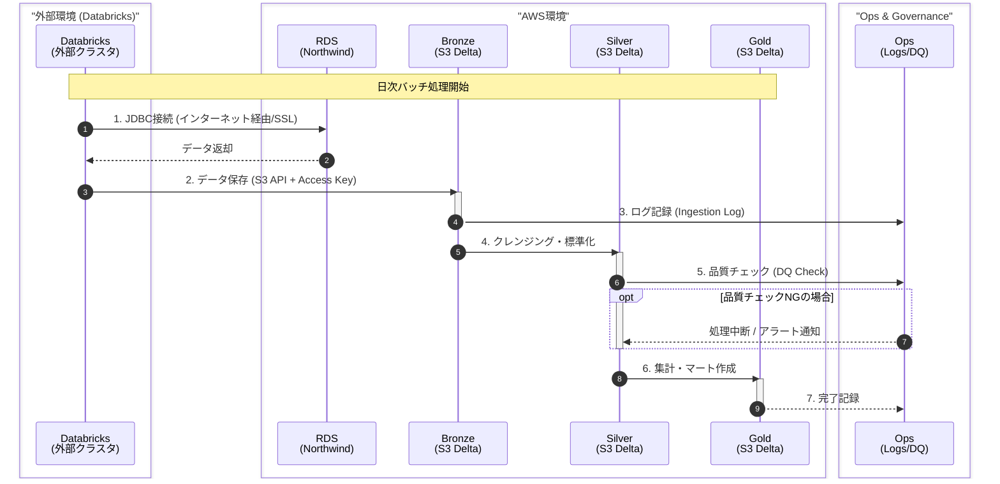

# データフロー（移行前）

移行前（暫定構成）のデータフローを示すシーケンス図です。

## 移行前の注意点

1. **JDBC接続はインターネット経由**: RDSのパブリックエンドポイントを使用
2. **SSL必須**: `sslmode=require` を接続文字列に含める
3. **S3接続はAccess Key**: IAM Role (Instance Profile) は使えないため、Databricks Secrets に Access Key を保存
