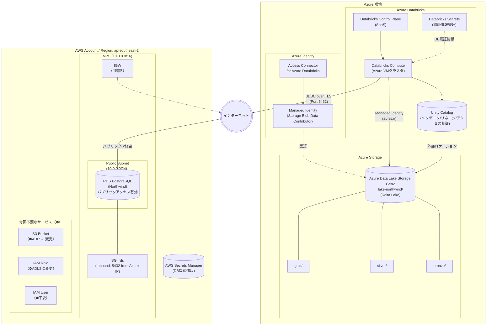

# システム構成図（移行前：Azure Databricks + Azure ADLS）

このダイアグラムは「**暫定構成: DatabricksがAzure上にあり、Azure Data Lake Storage (ADLS Gen2) をデータレイクとして使用する場合**」を示します。

## 前提条件

- **Databricks**: Azure Databricks（有料版）- Unity Catalog 使用可能
- **RDS**: ユーザー管理のAWSアカウント内に存在（ソースデータ）
- **データレイク**: Azure Data Lake Storage Gen2（Bronze/Silver/Gold）
- **接続**: 
  - Databricks ↔ ADLS: Azure内部通信（Managed Identity）
  - Databricks ↔ AWS RDS: インターネット経由（JDBC）

## ステータス凡例

- 通常表記: 記載済み
- `（📝暗黙）`: 存在が前提だが詳細は省略
- `（🔧詳細設計）`: 詳細設計フェーズで追加予定
- `（⛔不要）`: 今回のプロジェクトでは使用しない

## 構成要素一覧

| カテゴリ | 要素 | 説明 | ステータス |
|---------|------|------|------------|
| **Azure Databricks** | Control Plane | SaaSの管理コンソール | ✅ |
| | Compute | Azure VMベースのSparkクラスタ | ✅ |
| | Unity Catalog | メタデータ/リネージ/アクセス制御 | ✅ |
| | Databricks Secrets | 認証情報の安全な管理 | ✅ |
| **Azure Storage** | ADLS Gen2 | データレイク（Delta Lake形式で保存） | ✅ |
| | bronze/ | 受領データ（Raw） | ✅ |
| | silver/ | クレンジング済みデータ | ✅ |
| | gold/ | 集計・分析用デー | ✅ |
| **Azure Identity** | Access Connector | DatabricksとADLSを接続 | ✅ |
| | Managed Identity | ADLSへの認証（パスワードレス） | ✅ |
| **AWSネットワーク** | VPC | RDSを配置するネットワーク | ✅ |
| | Public Subnet | RDSをパブリックアクセス可能に配置 | ✅ |
| | Security Groups | Azure DatabricksのIPからのアクセスのみ許可 | ✅ |
| | IGW | VPCからインターネットへの出口 | 📝暗黙 |
| **AWSコンピュート** | RDS PostgreSQL | ソースデータ（Northwind） | ✅ |
| **AWSセキュリティ** | AWS Secrets Manager | DB接続情報の安全な管理 | ✅ |
| **今回不要** | S3 | ADLSに変更したため | ⛔不要 |
| | IAM Role/User | ADLSに変更したため | ⛔不要 |

---

## 接続方法の詳細

### 1. RDS への接続（AWS → Azure Databricks）

| 項目 | 設定 |
|------|------|
| **RDS パブリックアクセス** | 有効 (Publicly Accessible = Yes) |
| **Security Group** | Inbound: TCP 5432 を Azure Databricks の IP 範囲から許可 |
| **SSL/TLS** | 必須 (`sslmode=require`) |
| **接続文字列例** | `jdbc:postgresql://<RDS-endpoint>:5432/northwind?sslmode=require` |

> [!WARNING]
> パブリックアクセスはセキュリティリスクがあります。IP制限 + SSL を必ず設定してください。
> 本番環境では PrivateLink または VPN を使用してください。

### 2. ADLS への接続（Azure Databricks → ADLS Gen2）

| 項目 | 設定 |
|------|------|
| **認証方式** | Managed Identity（Access Connector for Azure Databricks） |
| **権限** | Storage Blob Data Contributor ロール |
| **Databricks設定** | Unity Catalog Storage Credential に Access Connector のリソースID を登録 |
| **パス形式** | `abfss://<container>@<storage-account>.dfs.core.windows.net/` |

### 3. Unity Catalog の設定

| 項目 | 設定 |
|------|------|
| **メタストア** | Azure Databricks ワークスペースに紐づけ |
| **外部ロケーション** | ADLS Gen2 を外部ロケーションとして登録 |
| **Storage Credential** | Access Connector for Azure Databricks（Managed Identity） |

## 移行後との差分

| 項目 | 移行前（暫定・本構成） | 移行後（最終） |
|------|------------------------|----------------|
| Databricks環境 | Azure Databricks | AWS Databricks（同一VPC） |
| データレイク | Azure ADLS Gen2 | AWS S3（同一VPC） |
| RDSアクセス | パブリックIP + SG制限 | Private Subnet + VPC内通信 |
| ストレージ認証 | Managed Identity | IAM Role (Instance Profile) |
| セキュリティ | 中（インターネット経由） | 高（VPC内完結） |
| Unity Catalog | ✅ 使用可能 | ✅ 使用可能 |

## 変更履歴

| 日付 | バージョン | 変更内容 |
|------|-----------|----------|
| 2024-02-08 | v2.0 | データレイクをAWS S3からAzure ADLS Gen2に変更 |
| | | Azure Databricksの制約（IAM Role読み取り専用）に対応 |
