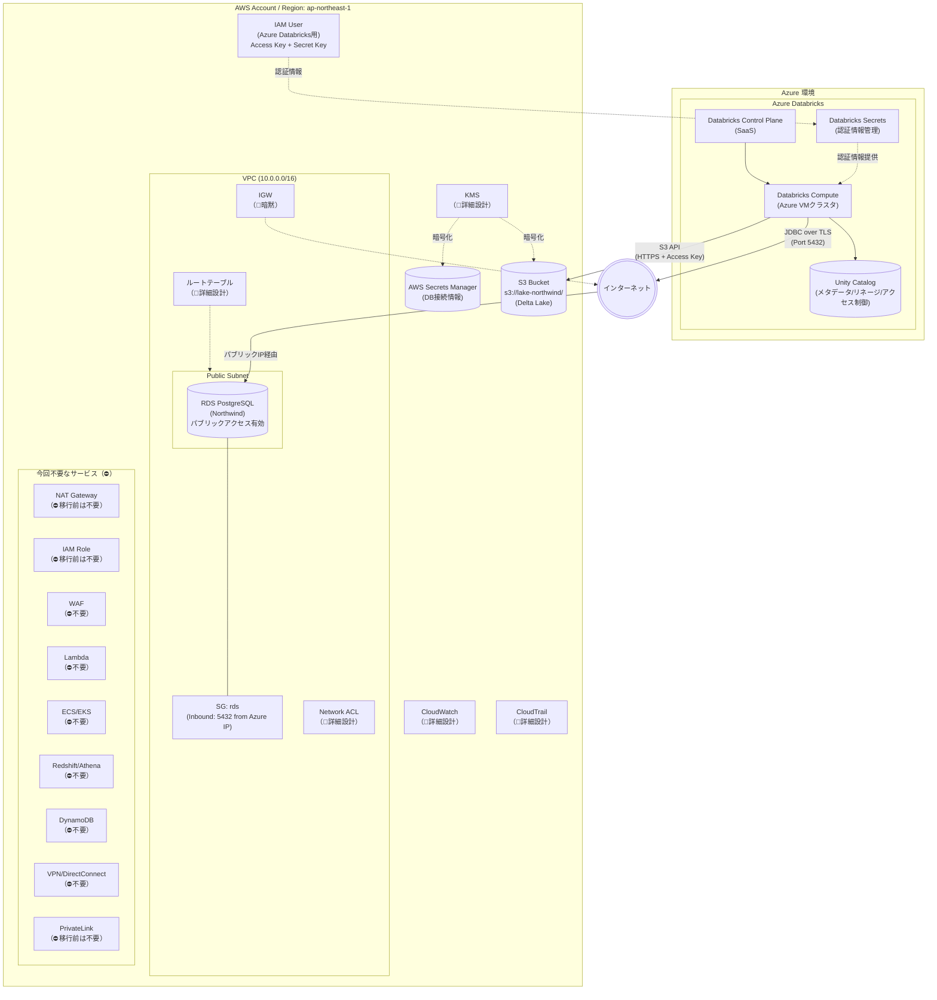

# システム構成図（移行前：Azure Databricks → AWS）

このダイアグラムは「**暫定構成: DatabricksがAzure上にあり、AWSのデータソースに接続する場合**」を示します。

## 前提条件

- **Databricks**: Azure Databricks（有料版）- Unity Catalog 使用可能
- **RDS**: ユーザー管理のAWSアカウント内に存在
- **S3**: ユーザー管理のAWSアカウント内に存在
- **接続**: インターネット経由（Azure ↔ AWS クロスクラウド）

## ステータス凡例

- 通常表記: 記載済み
- `（📝暗黙）`: 存在が前提だが詳細は省略
- `（🔧詳細設計）`: 詳細設計フェーズで追加予定
- `（⛔不要）`: 今回のプロジェクトでは使用しない

## 構成要素一覧

| カテゴリ | 要素 | 説明 | ステータス |
|---------|------|------|------------|
| **Azure Databricks** | Control Plane | SaaSの管理コンソール | ✅ |
| | Compute | Azure VMベースのSparkクラスタ | ✅ |
| | Unity Catalog | メタデータ/リネージ/アクセス制御 | ✅ |
| | Databricks Secrets | 認証情報の安全な管理 | ✅ |
| **AWSネットワーク** | VPC | RDSを配置するネットワーク | ✅ |
| | Public Subnet | RDSをパブリックアクセス可能に配置 | ✅ |
| | Security Groups | Azure DatabricksのIPからのアクセスのみ許可 | ✅ |
| | IGW | VPCからインターネットへの出口 | 📝暗黙 |
| | ルートテーブル | サブネットの経路制御 | 🔧詳細設計 |
| | Network ACL | サブネットレベルのファイアウォール | 🔧詳細設計 |
| | NAT Gateway | 移行前は外部接続のため不要 | ⛔移行前不要 |
| | PrivateLink | 移行前は外部接続のため不要 | ⛔移行前不要 |
| **AWSコンピュート** | RDS PostgreSQL | ソースデータ（Northwind） | ✅ |
| **AWSストレージ** | S3 | データレイク（Delta Lake形式で保存） | ✅ |
| **AWSセキュリティ** | IAM User | Azure DatabricksからのS3アクセス用（Access Key） | ✅ |
| | IAM Role | 移行前は外部接続のため不要 | ⛔移行前不要 |
| | AWS Secrets Manager | DB接続情報の安全な管理 | ✅ |
| | KMS | 暗号化キーの管理 | 🔧詳細設計 |
| **AWS監視/運用** | CloudWatch | ログ収集・メトリクス監視 | 🔧詳細設計 |
| | CloudTrail | API呼び出しの監査ログ | 🔧詳細設計 |
| **今回不要** | WAF | Webアプリへのアクセスがないため | ⛔不要 |
| | Lambda | サーバーレス関数を使用しないため | ⛔不要 |
| | ECS/EKS | コンテナを使用しないため | ⛔不要 |
| | Redshift/Athena | Databricksを使用するため | ⛔不要 |
| | DynamoDB | NoSQLを使用しないため | ⛔不要 |
| | VPN/DirectConnect | オンプレ接続がないため | ⛔不要 |

---

## 接続方法の詳細

### 1. RDS への接続

| 項目 | 設定 |
|------|------|
| **RDS パブリックアクセス** | 有効 (Publicly Accessible = Yes) |
| **Security Group** | Inbound: TCP 5432 を Azure Databricks の IP 範囲から許可 |
| **SSL/TLS** | 必須 (`sslmode=require`) |
| **接続文字列例** | `jdbc:postgresql://<RDS-endpoint>:5432/northwind?sslmode=require` |

> [!WARNING]
> パブリックアクセスはセキュリティリスクがあります。IP制限 + SSL を必ず設定してください。
> 本番環境では PrivateLink または VPN を使用してください。

### 2. S3 への接続

| 項目 | 設定 |
|------|------|
| **認証方式** | IAM User の Access Key + Secret Key |
| **権限** | S3 バケットへの Read/Write 権限 |
| **Databricks設定** | Databricks Secrets に Access Key を保存し、ノートブックから参照 |

### 3. Unity Catalog の設定

| 項目 | 設定 |
|------|------|
| **メタストア** | Azure Databricks ワークスペースに紐づけ |
| **外部ロケーション** | AWS S3 を外部ロケーションとして登録（Storage Credential使用） |
| **Storage Credential** | IAM User の Access Key を使用 |

## 移行後との差分

| 項目 | 移行前（暫定） | 移行後（最終） |
|------|----------------|----------------|
| Databricks環境 | Azure Databricks | AWS Databricks（同一VPC） |
| RDSアクセス | パブリックIP + SG制限 | Private Subnet + VPC内通信 |
| S3認証 | IAM User (Access Key) | IAM Role (Instance Profile) |
| セキュリティ | 中（インターネット経由） | 高（VPC内完結） |
| Unity Catalog | ✅ 使用可能 | ✅ 使用可能 |
