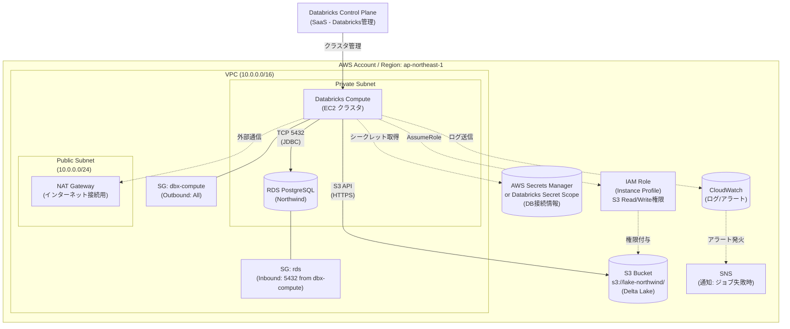

# システム構成図（物理・ネットワーク）

このダイアグラムは「**どこに何があるか**」を示す物理的な構成図です。

## 構成要素一覧

| カテゴリ | 要素 | 説明 |
|---------|------|------|
| **ネットワーク** | VPC | Databricks ComputeとRDSを同一VPCに配置 |
| | Private Subnet | RDSとComputeを配置（インターネット非公開） |
| | Public Subnet | NAT Gateway経由で外部通信 |
| | Security Groups | RDSへのアクセスをCompute IPのみに制限 |
| **コンピュート** | Databricks Compute | EC2ベースのSparkクラスタ |
| | RDS PostgreSQL | ソースデータ（Northwind） |
| **ストレージ** | S3 | データレイク（Delta Lake形式で保存） |
| **セキュリティ** | IAM Role | S3アクセス権限（Instance Profile経由） |
| | Secrets Manager | DB接続情報の安全な管理 |
| **監視/運用** | CloudWatch | ログ収集・メトリクス監視 |
| | SNS | ジョブ失敗時のメール/Slack通知 |
