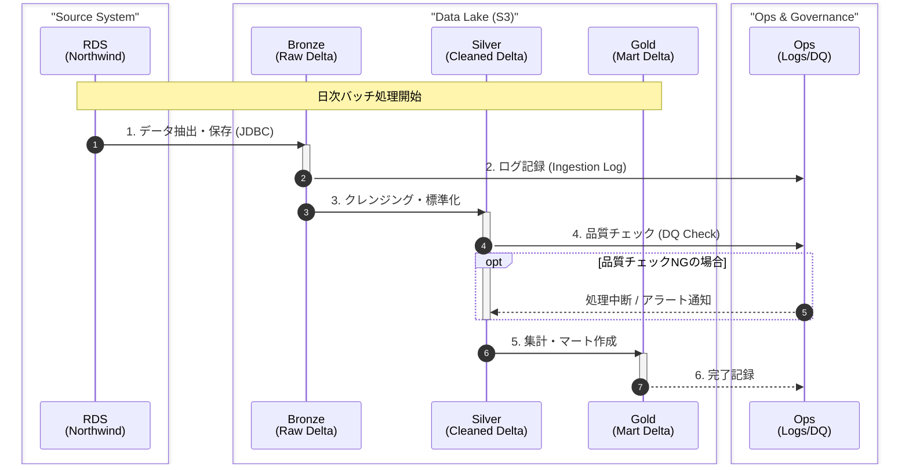

```mermaid
sequenceDiagram
  autonumber
  %% --- 登場人物（データ/システム）の定義 ---
  box "Source System" #f9f9f9
    participant RDS as RDS<br/>(Northwind)
  end
  
  box "Data Lake (S3)" #e1f5fe
    participant Bronze as Bronze<br/>(Raw Delta)
    participant Silver as Silver<br/>(Cleaned Delta)
    participant Gold as Gold<br/>(Mart Delta)
  end

  box "Ops & Governance" #fff3e0
    participant Ops as Ops<br/>(Logs/DQ)
  end

  %% --- 処理フロー ---
  Note over RDS, Gold: 日次バッチ処理開始

  %% 1. Ingest
  RDS->>Bronze: 1. データ抽出・保存 (JDBC)
  activate Bronze
  Bronze->>Ops: 2. ログ記録 (Ingestion Log)
  deactivate Bronze

  %% 2. Transform
  Bronze->>Silver: 3. クレンジング・標準化
  activate Silver
  Silver->>Ops: 4. 品質チェック (DQ Check)
  
  opt 品質チェックNGの場合
      Ops-->>Silver: 処理中断 / アラート通知
  end
  deactivate Silver

  %% 3. Aggregate
  Silver->>Gold: 5. 集計・マート作成
  activate Gold
  Gold-->>Ops: 6. 完了記録
  deactivate Gold
```
