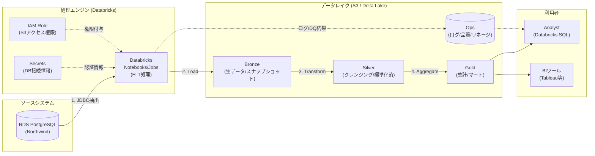

# 論理アーキテクチャ図

このダイアグラムは「**何をどう処理するか**」を示す論理的な構成図です。

```mermaid
flowchart LR
  %% ============================
  %% ノード定義
  %% ============================
  
  subgraph SourceSystem["ソースシステム"]
    src[("RDS PostgreSQL<br/>(Northwind)")]
  end

  subgraph ProcessingEngine["処理エンジン (Databricks)"]
    dbx["Databricks<br/>Notebooks/Jobs<br/>(ELT処理)"]
    sec["Secrets<br/>(DB接続情報)"]
    iam["IAM Role<br/>(S3アクセス権限)"]
  end

  subgraph DataLake["データレイク (S3 / Delta Lake)"]
    b["Bronze<br/>(生データ/スナップショット)"]
    s["Silver<br/>(クレンジング/標準化済)"]
    g["Gold<br/>(集計/マート)"]
    ops[("Ops<br/>(ログ/品質/リネージ)")]
  end

  subgraph Consumers["利用者"]
    analyst["Analyst<br/>(Databricks SQL)"]
    bi["BIツール<br/>(Tableau等)"]
  end

  %% ============================
  %% データフロー
  %% ============================
  src -->|"1. JDBC抽出"| dbx
  sec -.->|"認証情報"| dbx
  iam -.->|"権限付与"| dbx

  dbx -->|"2. Load"| b
  b -->|"3. Transform"| s
  s -->|"4. Aggregate"| g

  dbx -.->|"ログ/DQ結果"| ops

  g --> analyst
  g --> bi
  ops -.-> analyst
```

## 凡例

| 記号 | 意味 |
|------|------|
| `→` (実線) | データの流れ |
| `-.->` (点線) | メタデータ/制御の流れ |
| `[( )]` | データストア (DB/ファイル) |
| `[ ]` | 処理/サービス |
