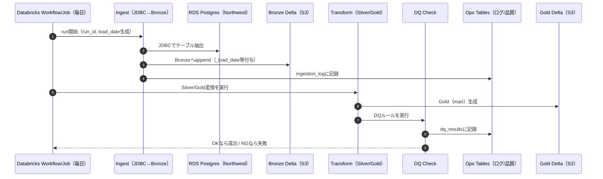

```mermaid
sequenceDiagram
  autonumber
  participant W as Databricks Workflow/Job（毎日）
  participant I as Ingest（JDBC→Bronze）
  participant P as RDS Postgres（Northwind）
  participant B as Bronze Delta（S3）
  participant T as Transform（Silver/Gold）
  participant D as DQ Check
  participant O as Ops Tables（ログ/品質）
  participant G as Gold Delta（S3）

  W->>I: run開始（run_id, load_date生成）
  I->>P: JDBCでテーブル抽出
  I->>B: Bronzeへappend（_load_date等付与）
  I->>O: ingestion_logに記録

  W->>T: Silver/Gold変換を実行
  T->>G: Gold（mart）生成
  T->>D: DQルールを実行
  D->>O: dq_resultsに記録
  D-->>W: OKなら成功 / NGなら失敗
```
