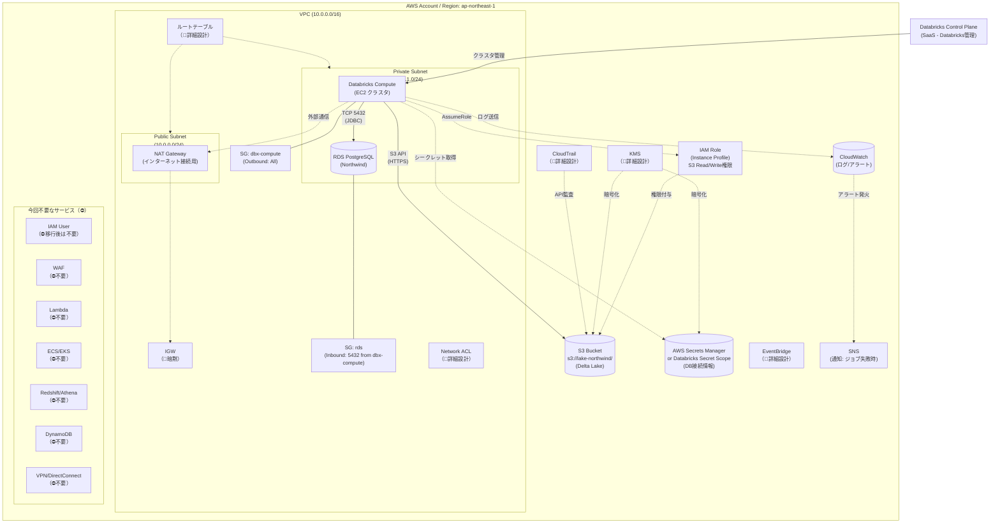

# システム構成図（移行後：AWS上のDatabricks）

このダイアグラムは「**どこに何があるか**」を示す物理的な構成図です。

## ステータス凡例

- 通常表記: 記載済み
- `（📝暗黙）`: 存在が前提だが詳細は省略
- `（🔧詳細設計）`: 詳細設計フェーズで追加予定
- `（⛔不要）`: 今回のプロジェクトでは使用しない

## 構成要素一覧

| カテゴリ | 要素 | 説明 | ステータス |
|---------|------|------|------------|
| **ネットワーク** | VPC | Databricks ComputeとRDSを同一VPCに配置 | ✅ |
| | Private Subnet | RDSとComputeを配置（インターネット非公開） | ✅ |
| | Public Subnet | NAT Gateway経由で外部通信 | ✅ |
| | Security Groups | RDSへのアクセスをCompute IPのみに制限 | ✅ |
| | IGW | VPCからインターネットへの出口 | 📝暗黙 |
| | ルートテーブル | サブネットごとの経路制御 | 🔧詳細設計 |
| | Network ACL | サブネットレベルのファイアウォール | 🔧詳細設計 |
| **コンピュート** | Databricks Compute | EC2ベースのSparkクラスタ | ✅ |
| | RDS PostgreSQL | ソースデータ（Northwind） | ✅ |
| **ストレージ** | S3 | データレイク（Delta Lake形式で保存） | ✅ |
| **セキュリティ** | IAM Role | S3アクセス権限（Instance Profile経由） | ✅ |
| | IAM User | 移行後はInstance Profileを使うため不要 | ⛔移行後不要 |
| | Secrets Manager | DB接続情報の安全な管理 | ✅ |
| | KMS | 暗号化キーの管理 | 🔧詳細設計 |
| **監視/運用** | CloudWatch | ログ収集・メトリクス監視 | ✅ |
| | SNS | ジョブ失敗時のメール/Slack通知 | ✅ |
| | CloudTrail | API呼び出しの監査ログ | 🔧詳細設計 |
| | EventBridge | イベント駆動のトリガー | 🔧詳細設計 |
| **今回不要** | WAF | Webアプリへのアクセスがないため | ⛔不要 |
| | Lambda | サーバーレス関数を使用しないため | ⛔不要 |
| | ECS/EKS | コンテナを使用しないため | ⛔不要 |
| | Redshift/Athena | Databricksを使用するため | ⛔不要 |
| | DynamoDB | NoSQLを使用しないため | ⛔不要 |
| | VPN/DirectConnect | オンプレ接続がないため | ⛔不要 |
